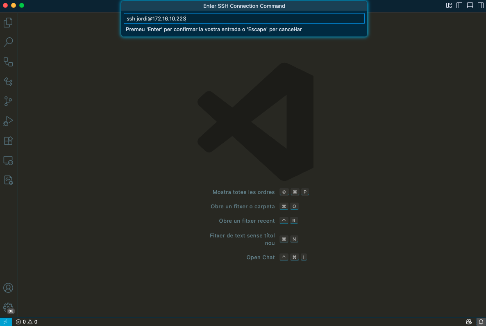
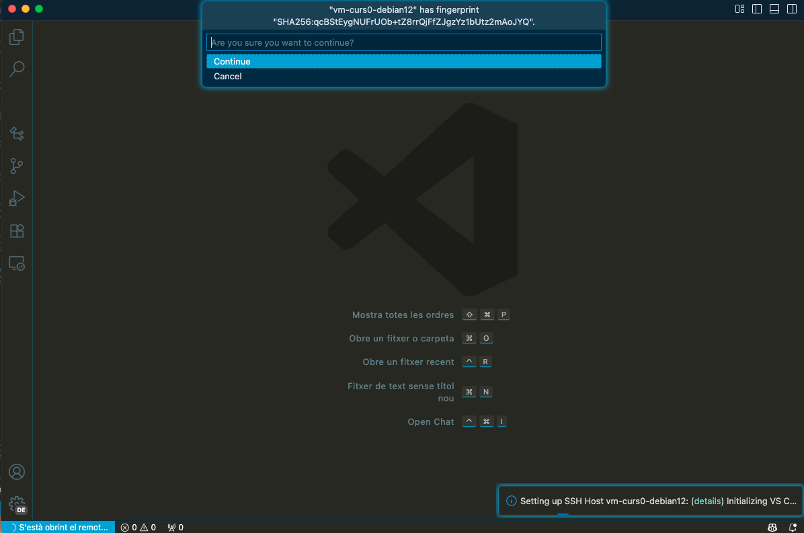
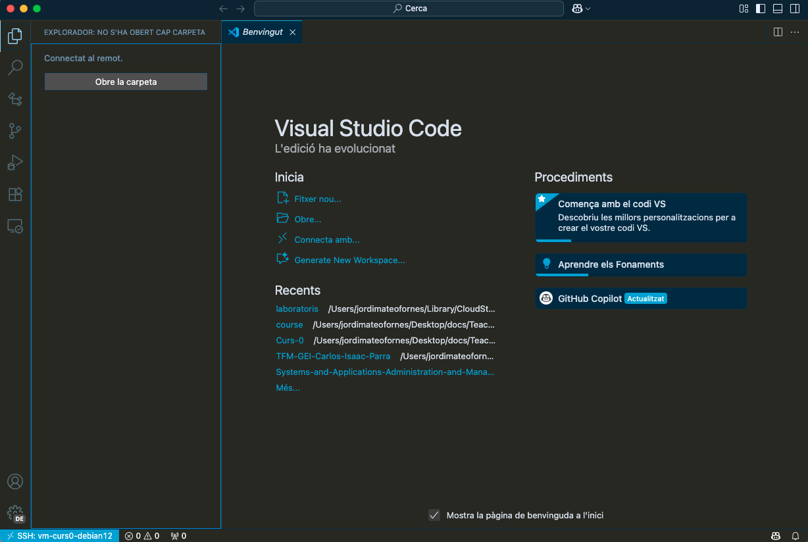
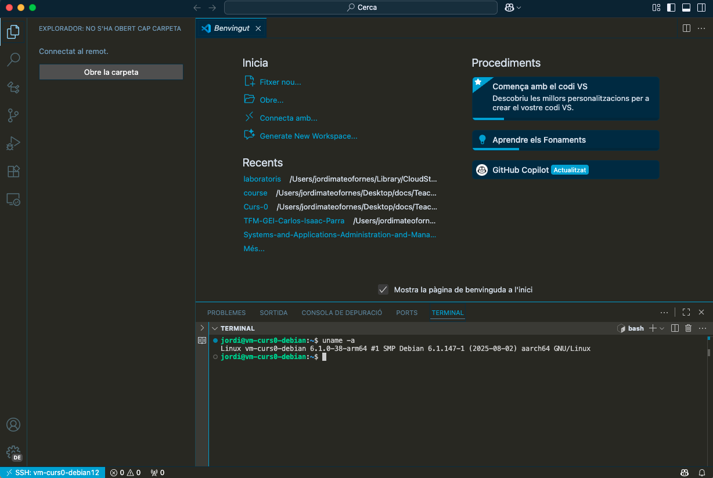

## Objectius

- Configurar el Visual Studio Code (VSCode) per connectar-se a la màquina virtual mitjançant SSH.

## Requisits previs

- Màquina virtual en funcionament (vegeu [Laboratori 2](lab02.md)).
- Visual Studio Code (VSCode) instal·lat al vostre ordinador. Podeu descarregar-lo des de [https://code.visualstudio.com/](https://code.visualstudio.com/).
- Obtenir la IP de la màquina virtual. Per fer-ho, podeu:
  -  Consultar la informació a VMWare:
    
  -  O bé, iniciar sessió a la màquina virtual i executar la comanda `ip a` per obtenir la IP:
    

  :::{.callout-note}
  En els dos casos, la IP de la màquina virtual és **172.16.10.223**.
  :::

## Configurant VSCode per connectar-se a la màquina virtual

Un cop hagueu instal·lat el vostre entorn de desenvolupament (IDE), podeu afegir les següents extensions utilitzant el marketplace de VSCode: **remote-ssh**. Primer, feu clic a **Marketplace (1)**, després cerqueu *remote-ssh* i, finalment, feu clic a **(3)** per instal·lar la extensió. Consulteu la imatge:


Un cop hagueu instal·lat la extensió, ja podeu connectar-vos a la màquina virtual. Per fer-ho, feu clic a la icona de la part inferior esquerra **(1)** i seleccioneu l'opció **Remote-SSH: Connect to Host... (2)**. Consulteu la imatge:


Ara apareixerà una finestra on podreu escriure la connexió SSH. També veureu l'opció **Add a New SSH Host**. Feu clic en aquesta opció i introduïu la comanda SSH per connectar-vos a la màquina virtual. Consulteu la imatge:



Seleccioneu la primera opció del menú desplegable amb la ruta del vostre usuari i feu clic a **Add**. Consulteu la imatge:


i comproveu que l'amfitrió s'ha afegit correctament.


Ara feu clic a **Open Config** i observeu que s'ha creat una nova entrada amb el vostre usuari i la IP de la màquina virtual:

```sh
Host 172.16.10.223
  HostName 172.16.10.223
  User jordi
```
Us recomano que modifiqueu el fitxer de configuració perquè sigui més fàcil de recordar. Per exemple, podeu canviar el nom de l'amfitrió per **vm-curs0-debian12** :

```sh
Host vm-curs0-debian12
  HostName 172.16.10.202
  User jordi
```

Un cop hagueu modificat el fitxer de configuració, guardem-lo i tanquem-lo. Ara ja podeu connectar-vos a la màquina virtual **vm-curs0-debian12**. Per fer-ho:

1. Feu clic a la icona de la part inferior esquerra.
2. Seleccioneu **Remote-SSH: Connect to Host...**.
3. Seleccioneu **vm-curs0-debian12**:

  - Us apareixerà una finestra emergent que us demanarà si voleu confiar en l'amfitrió. Feu clic a **Continue**.
    
  - Us apareixerà una altra finestra emergent que us demanarà la contrasenya de l'usuari **jordi**. 
    

:::{.callout-note}
La primera vegada que us connecteu a la màquina virtual, VSCode instal·larà el servidor remot a la màquina virtual. Això pot trigar uns minuts.
:::

Un cop us hàgiu connectat, veureu que la finestra de VSCode ha canviat i que ara esteu treballant a la màquina virtual. Podeu comprovar-ho a la part inferior esquerra on apareix el nom de l'amfitrió **vm-curs0-debian12**.



Per comprovar que tot funciona correctament, podeu obrir una terminal integrada a VSCode i executar la comanda `uname -a` per veure la informació del sistema i comprovar que esteu a la màquina virtual.



## Exercicis

1. Creeu carpetes i fitxers a la màquina virtual utilitzant la terminal integrada de VSCode.
2. Editeu fitxers utilitzant l'editor de VSCode.
3. Podeu pujar i baixar fitxers entre la màquina local i la màquina virtual utilitzant drag and drop.
